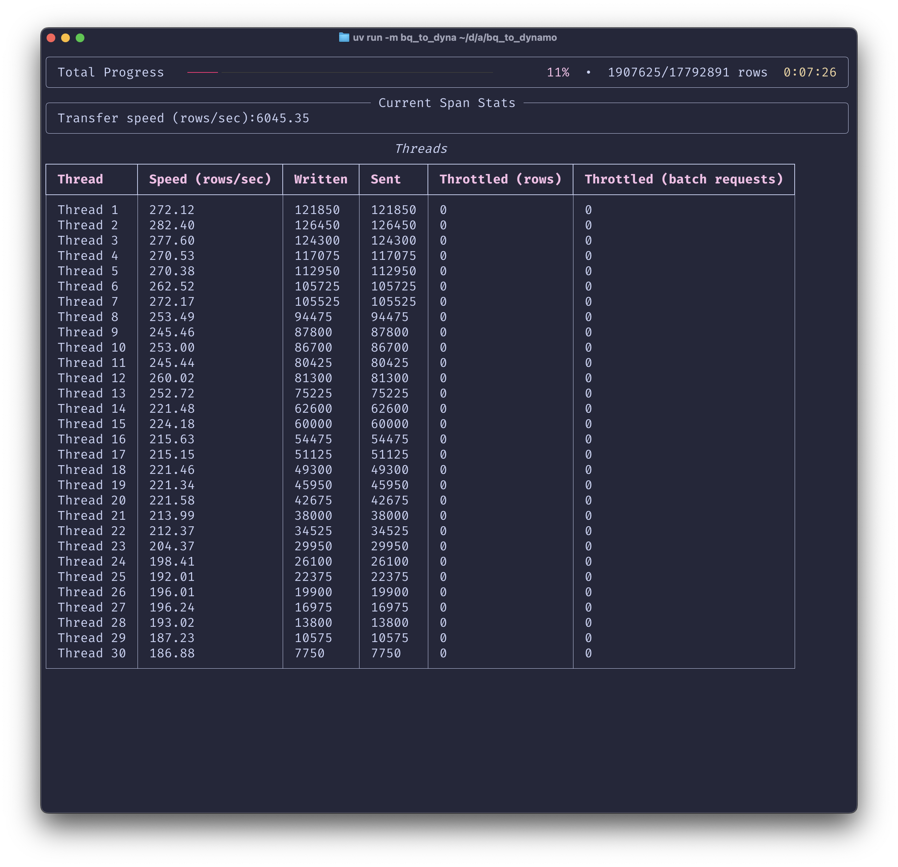

# BQ to DynamoDB data transfer experiments

## Key features

- [x] BigQuery table or query results as source (query results are always stored in a temporary table)
- [x] Memory efficient (data are read from BigQuery in chunks, [using BigQuery Storage SDK `list_rows` method](https://cloud.google.com/bigquery/docs/paging-results#page_through_query_results))
- [x] Exponential backoff retries for DynamoDB writes
- [x] Dynamic scaling of DynamoDB writers (threads), based on the current DynamoDB throttling

## Usage

```shell
uv sync
uv run -m bq_to_dynamo sample_transfer.yaml
```


